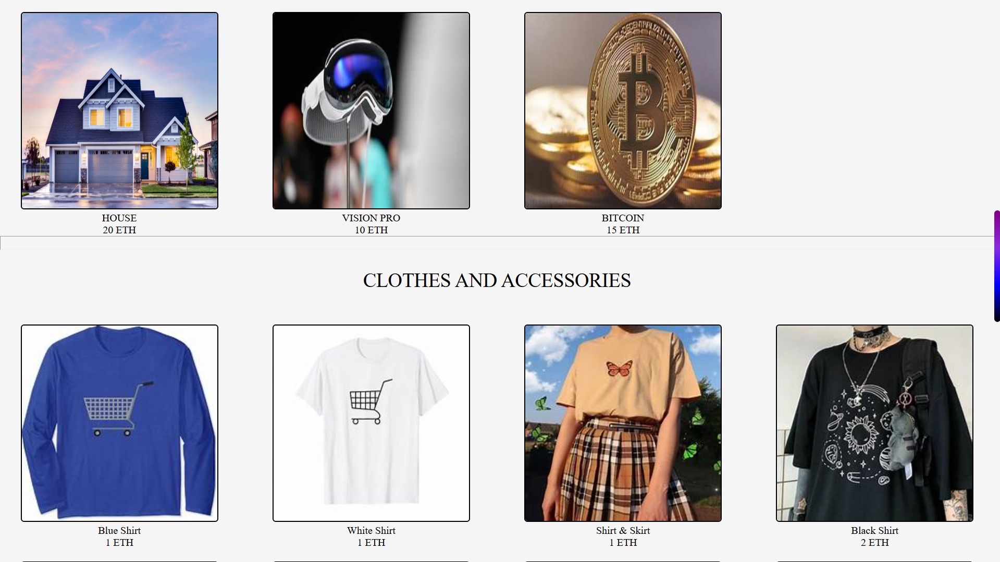
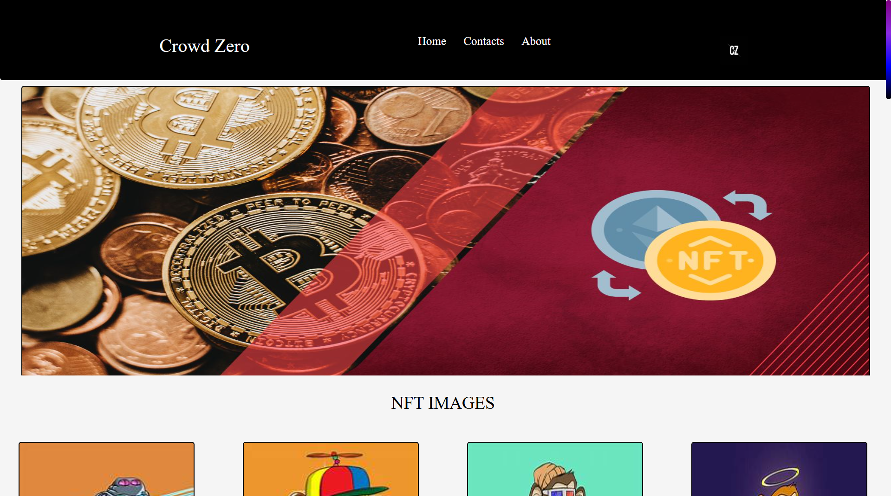
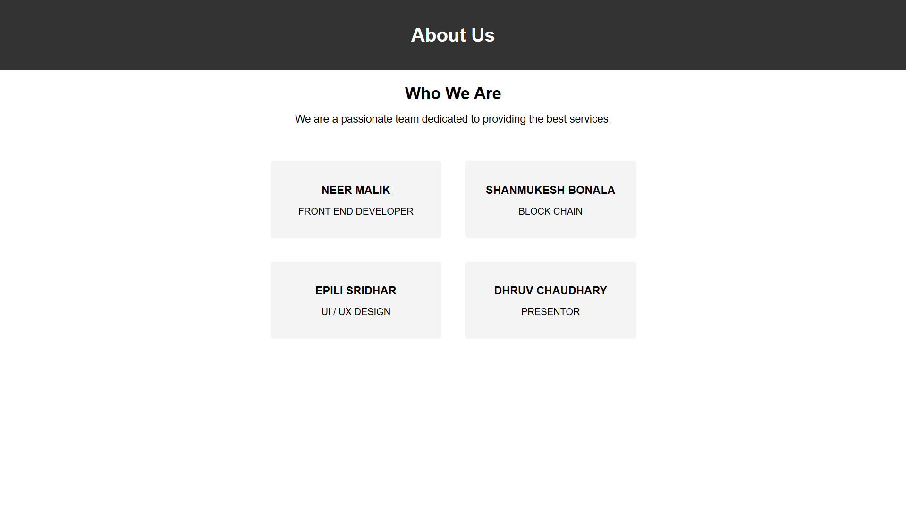
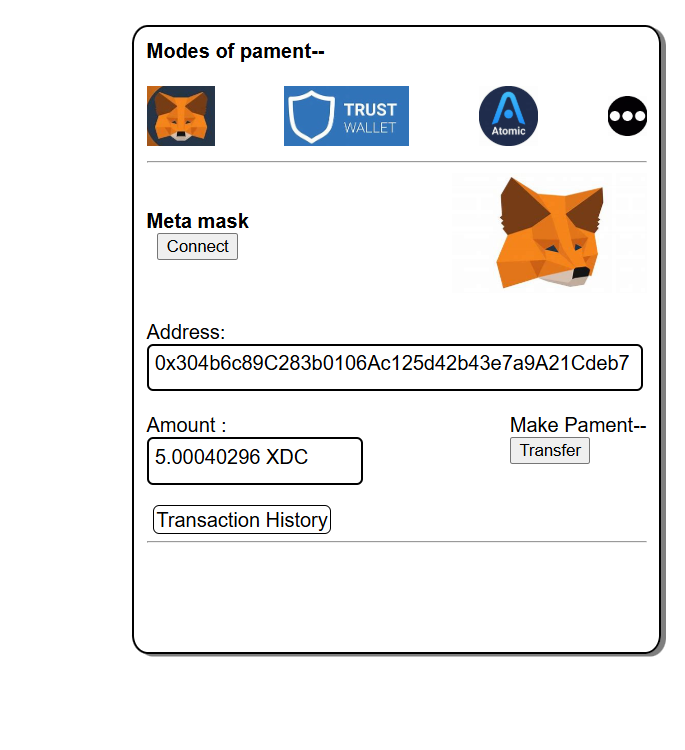

# Crowd Zero - Hackathon Story README

## Chapter 1: Where It All Started

This project was built during a **national-level hackathon conducted by huperlane (24-hour hackathon)**.

What began as an idea in a high-energy room full of builders, laptops, and countdown timers became **Crowd Zero**, a Web3-inspired e-commerce prototype where digital assets and physical-style products live in one marketplace experience.

The challenge was not just to build a website. The challenge was to build something that felt like the **future of commerce**:
- product discovery,
- NFT-style listings,
- and blockchain wallet interaction,
all inside one fast-moving hackathon timeline.

In those 24 hours, every minute mattered. Every page, every button, every style tweak, every transaction status message was part of a race against time.

---

## Chapter 2: The Core Idea

**Crowd Zero** explores a simple but bold question:

> What if an online store blended normal shopping flow with Web3 wallet-based payment interaction?

This project presents a marketplace-style interface with sections like:
- NFT Images,
- Assets and Contracts,
- Clothes and Accessories,

and then routes users into payment pages where they can:
- connect MetaMask,
- trigger transaction flow,
- and view transaction status feedback in the UI.

The app is currently a front-end heavy prototype that demonstrates the concept and flow clearly.

---

## Chapter 3: Team Behind The Build

As represented in the project pages, the contributors include:

- **Neer Malik** - Front End Developer
- **Shanmukesh Bonala** - Blockchain
- **Epili Sridhar** - UI/UX Design
- **Dhruv Chaudhary** - Presenter

This mix of roles helped the team move from concept to demo under strict hackathon pressure.

---

## Chapter 4: What The Website Contains

### Landing and Entry Experience
- `frontwebpage.html` acts as a hero landing page with a welcome interaction.
- It routes users into the core marketplace view.

### Main Marketplace
- `mainweb.html` is the primary catalog page.
- Categories include NFT items, digital assets/contracts, and fashion/accessories.
- Product cards link to transaction pages such as `index1.html`, `index2.html`, `index5.html`, `index10.html`, `index15.html`, and `index20.html`.

### Payment / Wallet Interaction Pages
- These pages demonstrate MetaMask-based flow.
- Users can connect wallet and attempt transfer actions.
- UI gives real-time transaction status feedback (success/fail/not installed).

### Extra Content Pages
- `aboutuspage.html` presents team and background.
- `html.html`, `EXTRA.HTML`, `level1part2.html`, and others support additional flows/content from the hackathon build.

### Styling and Assets
- CSS files such as `mainweb.css`, `styles.css`, `search.css`, and `extra.css` shape the visual presentation.
- A large media set (`.jpg`, `.jpeg`, `.png`, `.webp`) powers the product/catalog experience.

---

## Chapter 5: Technology Snapshot

This prototype uses:
- **HTML5** for structure
- **CSS3** for styling
- **JavaScript** for interactivity
- **Web3.js (CDN)** for MetaMask/Ethereum interaction on transaction pages

No heavy backend framework is required for basic demo viewing.

---

## Chapter 6: How To Run The Project Locally

### Option 1 (quick)
1. Open the project folder in VS Code.
2. Open `frontwebpage.html` in a browser.
3. Click **Welcome** to enter the main marketplace.

### Option 2 (recommended)
Use Live Server (or any local static server) so file routing works smoothly across pages.

If you have Node/npm:
1. Install any simple static server globally (example: `http-server`) if needed.
2. Start server from project root.
3. Open the served URL and begin from `frontwebpage.html`.

---

## Chapter 7: Screenshots (Current Website Look)

These images show how the website currently looks.

### Preview 1

### Preview 2

### Preview 3

### Preview 4

### Preview 5

---

## Chapter 8: Folder Highlights

Important files in this repository:

- `frontwebpage.html` - landing page
- `mainweb.html` - main marketplace page
- `aboutuspage.html` - about/team page
- `index1.html`, `index2.html`, `index5.html`, `index10.html`, `index15.html`, `index20.html` - transaction/payment flow pages
- `mainweb.css`, `styles.css`, `search.css`, `extra.css` - stylesheets
- `index5.js` - script placeholder
- image assets (`.jpg`, `.jpeg`, `.png`, `.webp`) - product and UI visuals

---

## Chapter 9: What Makes This Special

Hackathon projects are often remembered not because they are perfect, but because they are **fearless**.

Crowd Zero captures that spirit:
- rapid idea-to-implementation,
- Web2 + Web3 concept blending,
- design and blockchain flow in one prototype,
- and a complete, demo-ready journey made under a 24-hour deadline.

This project is a snapshot of a team building with urgency, creativity, and ambition.

---

## Chapter 10: Future Scope

Possible next upgrades:
- integrate a real backend for product/user/order data,
- add wallet/network validation and safer transaction UX,
- improve accessibility and mobile responsiveness,
- include search/filter/sort with dynamic data,
- persist transaction history to a database,
- deploy as a full-stack cloud-hosted application.

---

## Closing Note

This repository is more than source code. It is the output of a high-pressure national hackathon sprint, where the objective was to transform an idea into something users can click, explore, and experience.

**Crowd Zero** stands as that story in code form.
